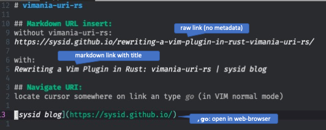

# vimania-uri-rs

**Advanced URI Handling for the Modern Vim User**

[](https://pepy.tech/project/vimania-uri-rs)
[![PyPI Version][pypi-image]][pypi-url]
[![Build Status][build-image]][build-url]
[](https://github.com/sysid/vimania-uri-rs/actions/workflows/test.yml)

> **Background**: [Rewriting a Vim Plugin in Rust](https://sysid.github.io/rewriting-a-vim-plugin-in-rust-vimania-uri-rs/)

A high-performance Rust reimplementation of the [vimania-uri](https://github.com/sysid/vimania-uri) Vim plugin, delivering **10x faster startup times** with advanced URI handling capabilities.

## Key Features

- **Lightning Fast**: 10x faster startup than pure Python implementations
- **Universal URI Support**: Handle web URLs, local files, internal links, and more
- **Smart Markdown Integration**: Auto-fetch page titles for reference-style links
- **Precise Navigation**: Jump to specific headings, line numbers, or anchors
- **Security First**: Built-in SSRF protection and comprehensive security auditing
- **Extensive Format Support**: Open HTML, DOCX, PPTX, images, audio, and more
- **Modern Architecture**: Rust core with Python integration for optimal performance

## Why vimania-uri-rs?

While Vim's native `gx` command and existing plugins provide basic URI handling, they often fall short in terms of:
- **Performance**: Slow startup times and laggy URL processing
- **Features**: Limited format support and navigation capabilities  
- **Security**: No protection against malicious URLs

vimania-uri-rs addresses all these limitations with a modern, high-performance solution.

### Demo



[📺 Watch the full demo on YouTube](https://www.youtube.com/watch?v=JLaN6cIAIY8)

**Best paired with**: [vim-markdown](https://github.com/preservim/vim-markdown), but works excellently with any file type.

## Quick Start

**It's simple**: Position your cursor on any URI and press `go`.

```vim
go
```

That's it! The plugin intelligently determines how to handle the URI based on its type and context.

## Handled Link Types
- **local text links**:
    `[foo](second.md)` will be opened inside vim.
    If the target contains line number as in `[foo](second.md:30)`, the line
    will be jumped to.
    Also anchors are supported, for example `[foo](second.md#custom-id)`.
- **URL links**:
    `[google](https://google.com)` will be opened with the OS browser.
- **non text files**:
    if the option `g:vimania-uri#Extensions` is set, non text files will be opened
    via the operating system.
    This behavior is handy when linking to binary documents, for example PDFs.
- **internal links**:
    `[Link Text](#Target)`, will link to the heading `# Target`.
    Following the link will jump to the heading inside vim.
    Currently both github style anchors, all words lowercased and hyphenated,
    and jupyter style anchros, all words hyphenated, are supported.
- **reference style links**:
    for links of the form `[foo][label]`, vimania-uri will lookup the corresponding
    label and open the target referenced there.
- **implicit name links**:
    for links of the form `[foo][]` will use `foo` as the label and then follow
    the logic of reference style links.
- **custom ids via attribute lists**:
    the id a link target can be defined via [attribute lists][attr-lists] of
    the form `{: #someid ...}`.
    This way fixed name references can be defined to prevent links from going
    stale after headings have been changed.
- **local link format of pelican**:
    vimania-uri handles `|filename| ...` and `{filename} ...` links as expected, for
    example `[link](|filename|./second.md)` and
    `[link]({filename}../posts/second.md)`.


#### Usage

In VIM normal mode in a Markdown document, type `go` while curser is on markdown-link.
If the link is a local file it will be opened in vim (`C-o` will get you back).
Otherwise, it will be opened via OS `open` command (.e.g Web-Broser, Microsoft Office, ...).

The following links will be handled (the possible cursor positions are indicated by `^`):

    Local text links: [link](foo.md) will be opened inside vim. 
                      ^^^^^^^^^^^^^^
    If target contains line number as in [link](foo.md:30), the line will be jumped to. 
    Also anchors are supported, for example [link](foo.md#anchor)

    This [link](https://example.com) will be opened inside the browser.
         ^^^^^^^^^^^^^^^^^^^^^^^^^^^

    This $HOME/dir will be opened inside OS file browser
         ^^^^^^^^^

    This $HOME/dir/present.pptx will open in Powerpoint
         ^^^^^^^^^^^^^^^^^^^^^^

    [link](example.pdf) will be opened in pdf reader
    ^^^^^^^^^^^^^^^^^^^

    Document internal linking works, too: to link to the heading Usage, use
    this [link](#usage).
         ^^^^^^^^^^^^^^

    Reference style [links][ref-style-link] will open http://example.com in browser
                    ^^^^^^^^^^^^^^^^^^^^^^^
    [ref-style-link]: http://example.com


## ⚙️ Configuration

### Core Settings

```vim
" File extensions to open in Vim (others use OS default)
let g:vimania_uri_extensions = ['.md', '.txt', '.rst', '.py', '.conf', '.sh', '.json', '.yaml', '.yml']


" Custom key mapping (default: 'go')
nmap <leader>u <Plug>vimania_uri_go
```

### Advanced Configuration

```vim
" Log level for debugging (DEBUG, INFO, WARNING, ERROR)
let g:vimania_uri_log_level = 'INFO'

" Timeout for URL requests (milliseconds)
let g:vimania_uri_timeout = 3000

" Custom browser command (optional)
let g:vimania_uri_browser_cmd = 'firefox'
```

### Environment Variables

- `LOG_LEVEL`: Override log level (DEBUG, INFO, WARNING, ERROR)
- `VIMANIA_URI_TIMEOUT`: Request timeout in seconds
---

## 📦 Installation

### Prerequisites
- Vim compiled with `+python3` support
- Python 3.10 or higher
- `pip` in your PATH

### Method 1: vim-plug (Recommended)

```vim
" Add to your .vimrc
Plug 'https://github.com/sysid/vimania-uri-rs.git', {
  \ 'do': 'pip install vimania-uri-rs --upgrade --target ~/.vim/plugged/vimania-uri-rs/pythonx',
  \ 'branch': 'main'
  \ }

" Configuration
let g:vimania_uri_extensions = ['.md', '.txt', '.rst', '.py', '.json', '.yaml']
```

### Method 2: Build from Source

For developers or if you want the latest features:

```vim
" Requires: rust, maturin in PATH
Plug 'https://github.com/sysid/vimania-uri-rs.git', {
  \ 'do': 'python3 build.py',
  \ 'branch': 'main'
  \ }
```

### Method 3: Manual Installation

```bash
cd ~/.vim/plugged
git clone https://github.com/sysid/vimania-uri-rs.git
cd vimania-uri-rs
python3 build.py
```

### Post-Installation

1. Restart Vim
2. Run `:helptags ALL` to refresh help documentation
3. Test with `:echo has('python3')` (should return 1)

### Supported Platforms
- ✅ Linux (x86_64, ARM64)
- ✅ macOS (Intel, Apple Silicon)
- ⚠️ Windows (experimental support)

<br>

## Credits
- inspired by [UltiSnips](https://github.com/SirVer/ultisnips).
- URI handling is based on work of Christopher Prohm: mdnav 

## Similar work
- [pursuit](https://github.com/jeetsukumaran/vim-pursuit)

<!-- Badges -->

[pypi-image]: https://badge.fury.io/py/vimania-uri-rs.svg
[pypi-url]: https://pypi.org/project/vimania-uri-rs/
[build-image]: https://github.com/sysid/vimania-uri-rs/actions/workflows/release.yml/badge.svg
[build-url]: https://github.com/sysid/vimania-uri-rs/actions/workflows/release.yml
