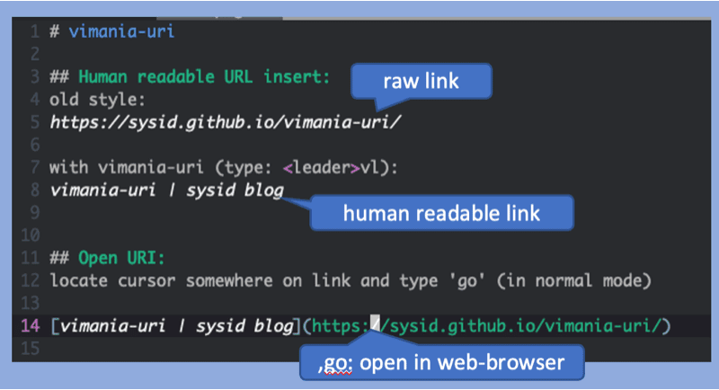

# Advanced URI Handling for the Modern Vim User

> Intuitive, Fast, and Powerful

Background: https://sysid.github.io/vimania-uri-rs/

This Rust re-implementation of VIM plugin [vimania-uri](https://github.com/sysid/vimania-uri)
with 10x faster VIM startup time and [bkmr](https://github.com/sysid/bkmr) integration.

# Key Features
1. **Open URIs and Various File Types**: Seamlessly open URIs, HTML files, DOCX, PPTX, JPG, PNG, MP3, and more.
2. **Handle Almost Any URI**: Manage a wide range of URI formats, ensuring maximum compatibility and flexibility.
3. **Paste URLs as Markdown Links**: Automatically fetch the title and create reference-style Markdown links for easy documentation.
4. **Jump to Headings or Line Numbers**: Navigate directly to specific headings or line numbers within files for quick access.
5. **Bookmark Manager Integration**: Load your URIs into Rust based CLI Bookmark Manager [bkmr](https://github.com/sysid/bkmr).

# Why?
Vim's native `gx` is effective but limited.
Same is true for other plugins I am aware of. 
I wanted more powerful URI handling in my markdown files.



## User Interface

> Position cursor on URI and type `go`.

    go

## Handled Link Types
- **local text links**:
    `[foo](second.md)` will be opened inside vim.
    If the target contains line number as in `[foo](second.md:30)`, the line
    will be jumped to.
    Also anchors are supported, for example `[foo](second.md#custom-id)`.
- **URL links**:
    `[google](https://google.com)` will be opened with the OS browser.
- **non text files**:
    if the option `g:vimania-uri#Extensions` is set, non text files will be opened
    via the operating system.
    This behavior is handy when linking to binary documents, for example PDFs.
- **internal links**:
    `[Link Text](#Target)`, will link to the heading `# Target`.
    Following the link will jump to the heading inside vim.
    Currently both github style anchors, all words lowercased and hyphenated,
    and jupyter style anchros, all words hyphenated, are supported.
- **reference style links**:
    for links of the form `[foo][label]`, vimania-uri will lookup the corresponding
    label and open the target referenced there.
- **implicit name links**:
    for links of the form `[foo][]` will use `foo` as the label and then follow
    the logic of reference style links.
- **custom ids via attribute lists**:
    the id a link target can be defined via [attribute lists][attr-lists] of
    the form `{: #someid ...}`.
    This way fixed name references can be defined to prevent links from going
    stale after headings have been changed.
- **local link format of pelican**:
    vimania-uri handles `|filename| ...` and `{filename} ...` links as expected, for
    example `[link](|filename|./second.md)` and
    `[link]({filename}../posts/second.md)`.


#### Usage

In normal model within a Markdown document, press `go` on a markdown-link to open it.
If the link is a local file it will be opened in vim (`C-o` will get you back).
Otherwise, it will be opened via OS (.e.g Web-Broser, Microsoft Office, ...).

The following links can be used (the possible cursor positions are indicated by `^`):

    This [link](https://example.com) will be opened inside the browser.
         ^^^^^^^^^^^^^^^^^^^^^^^^^^^

    This [link](./foo.md) will open `./foo.md` inside vim.
         ^^^^^^^^^^^^^^^^

    This [link](|filename|./foo.md) will open `./foo.md` inside vim.
         ^^^^^^^^^^^^^^^^^^^^^^^^^^

    This $HOME/dir will be opened inside file browser
         ^^^^^^^^^

    This $HOME/dir/present.pptx will open in Powerpoint
         ^^^^^^^^^^^^^^^^^^^^^^


    If `g:vimania-uri_Extensions` is set to `.md, .MD`

    [link](|filename|./example.pdf) will be opened in pdf reader
    ^^^^^^^^^^^^^^^^^^^^^^^^^^^^^^^

    Document internal linking works, too: to link to the heading Usage, use
    this [link](#usage).
         ^^^^^^^^^^^^^^

    Reference style [links][ref-style-link] will open http://example.com in browser
                    ^^^^^^^^^^^^^^^^^^^^^^^
    [ref-style-link]: http://example.com


The behavior can be configured via the following options:

- `g:vimania_uri_extensions`:
    a comma separated list of file extensions.
    Only files with the given extensions will be opened in vim, all other
    files will be opened via the configured application (using `open` on OSX
    and `xdg-open` on linux).

- `g:vimania_uri_twbm_integration`:
    Boolean flag to configure [bkmr](https://github.com/sysid/bkmr) integration (see below)

---

## Installation
Using [vim-plug](https://github.com/junegunn/vim-plug):
```vim
Plug 'https://github.com/sysid/vimania-uri-rs.git', {'do': 'pip install vimania-uri-rs --upgrade --target ~/.vim/plugged/vimania-uri-rs/pythonx', 'branch': 'main'}
  let g:vimania_uri_extensions=['.md','.txt','.rst','.py']
  let g:vimania_uri_twbm_integration=1  # if bkmr is installed else 0
```
- vim needs to be configured with python support
- `pip` must be in path to install required dependencies into `vimania/pythonx` (no pollution of system python).
- tested on Linux/MacOS

Alternatively if you want to compile it yourself:
```vim
Plug 'https://github.com/sysid/vimania-uri-rs.git', {'do': 'python3 build.py', 'branch': 'main'}
```
- `rust, maturin` must be installed (on PATH) to build the plugin

<br>

## Credits
- inspired by [UltiSnips](https://github.com/SirVer/ultisnips).
- URI handling is based on work of [mdnav](https://github.com/chmp/mdnav)

<!-- Badges -->
